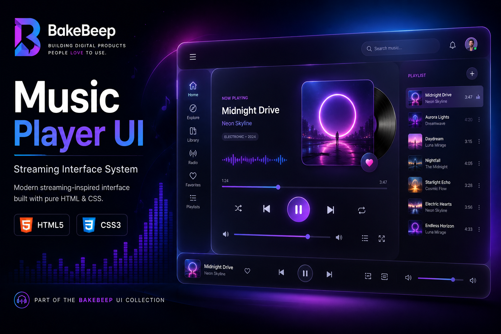
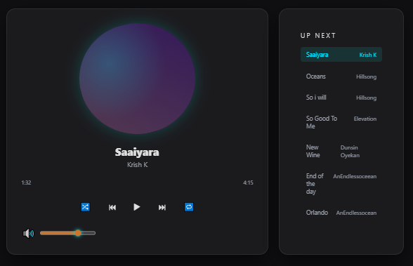
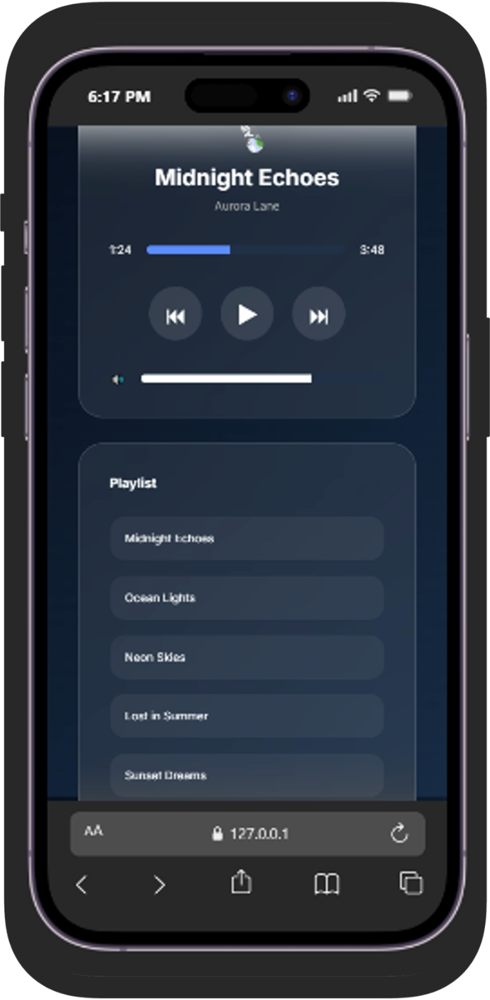

# Music Player UI

> A modern streaming-inspired music player built with HTML and CSS.




> **BakeBeep UI Collection**

This project is part of the **BakeBeep UI Collection**—a growing library of modern, reusable interface components and frontend patterns designed with performance, accessibility, and maintainability in mind.

---

## Overview

Music Player UI recreates the interface of a modern music streaming application using only HTML and CSS. It demonstrates advanced layout composition, glassmorphism effects, responsive design, and interactive visual styling without relying on JavaScript.

The project explores how elegant user interfaces can be crafted using core web technologies while maintaining a clean and reusable structure.

---

## Features

- Streaming-inspired interface
- Glassmorphism design
- Responsive layout
- Animated album artwork
- Progress bar
- Playback controls
- Volume slider
- Playlist sidebar
- Modern typography
- Mobile-friendly layout..

---

## Demo

🌐 **Live Demo:** Add your Vercel deployment URL here.


### Desktop



### Mobile



---

## Design Philosophy

The interface emphasizes visual clarity, depth, and usability. Glassmorphism, spacing, and hierarchy work together to create an interface that feels modern while remaining functional and adaptable.

---

## Technologies

- HTML5
- CSS3
- Flexbox
- Media Queries
- CSS Animations
- Backdrop Filter
- Custom Properties

---

## Folder Structure

```text
music-player-ui/
│
├── assets/
├── css/
├── index.html
└── README.md
```

---

## Future Improvements

- Audio playback functionality
- Playlist management
- Theme switching
- Dark and light modes
- Keyboard shortcuts
- Accessibility improvements
- React implementation
- Music API integration

---

## License

MIT License.

---

## About BakeBeep

BakeBeep is a software studio building modern web interfaces, reusable UI systems, and developer-focused digital products.

Every repository reflects our commitment to clean engineering, thoughtful design, accessibility, and continuous improvement.

Explore the BakeBeep UI Collection to discover more frontend projects.